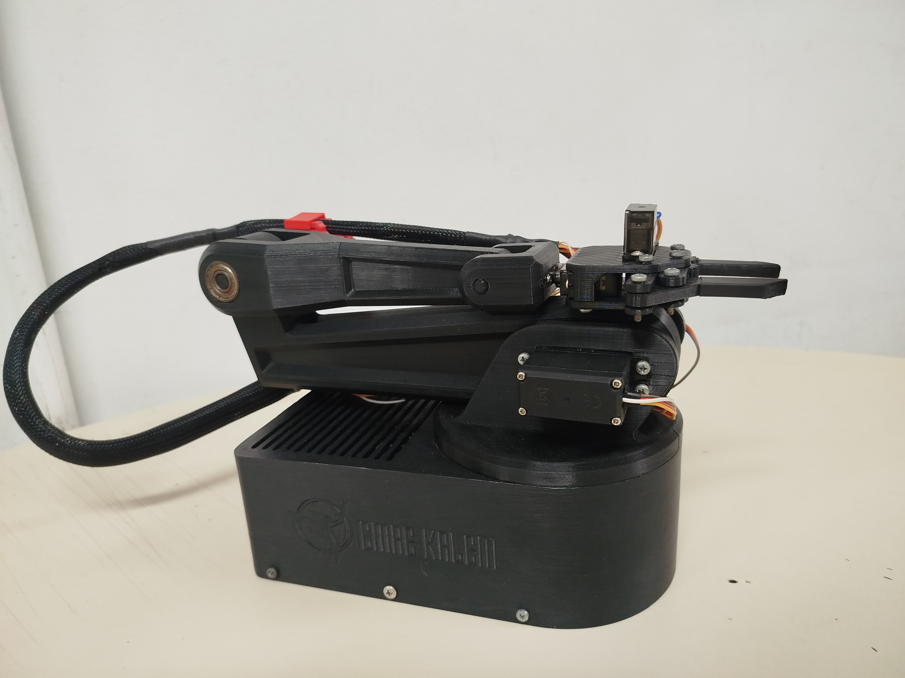
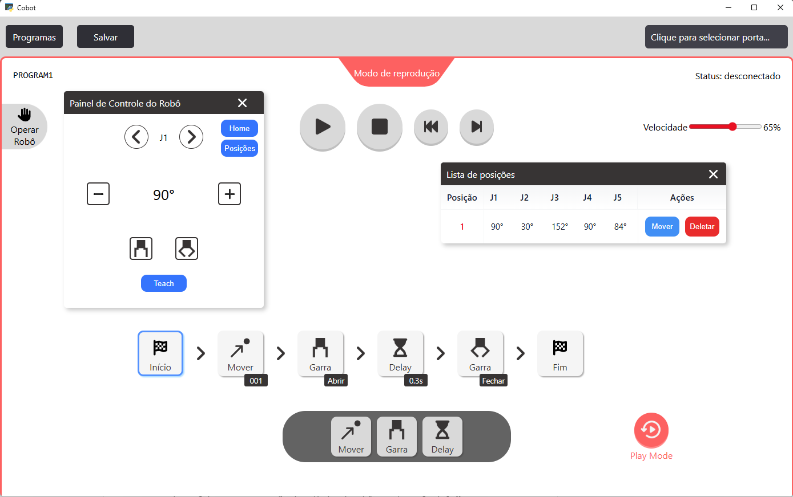

# TCC-Mecatronica-Cobot
Aqui neste repositório, contém o software desktop e o firmware para ESP32, desenvolvido para controle do Cobot, o braço robótico colaborativo. Projeto de TCC do curso Técnico em Mecatrônica, para a ETEC Martin Luther King

### Integrantes do Projeto:
- Breno Lanzoni de Matos
- Henrique da Silva Costa
- Maria Larisse Alves dos Santos

> Embora houve a participação dos meus colegas no braço robótico, **toda a parte de programação, tanto o software desktop em Python, quando o Firmware para ESP32 foi desenvolvido por mim**, devido minha expertise e experiência.

### Estrutura do Repositório
**Cobot**: Firmware para ESP32

**CobotController**: Software para controle do robô

### Demonstração

Vídeo de execução do robô: [Assista à demonstração](https://drive.google.com/file/d/1DOJ-S2BWWZ3sCByC9He4OBuAyC6gLQAC/view?usp=drive_link)
